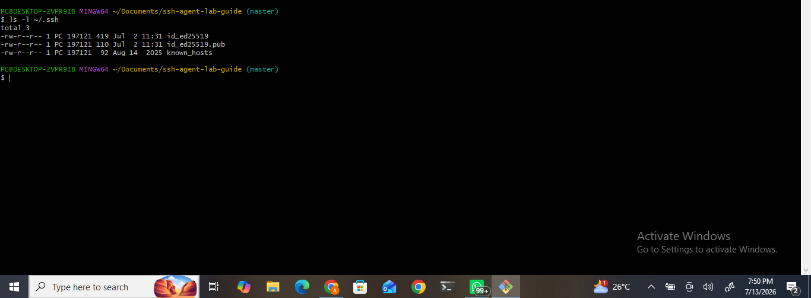
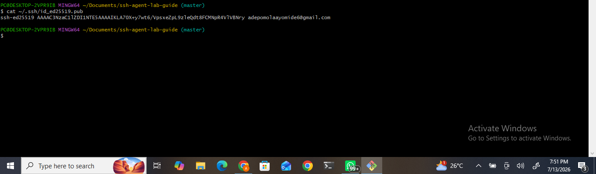
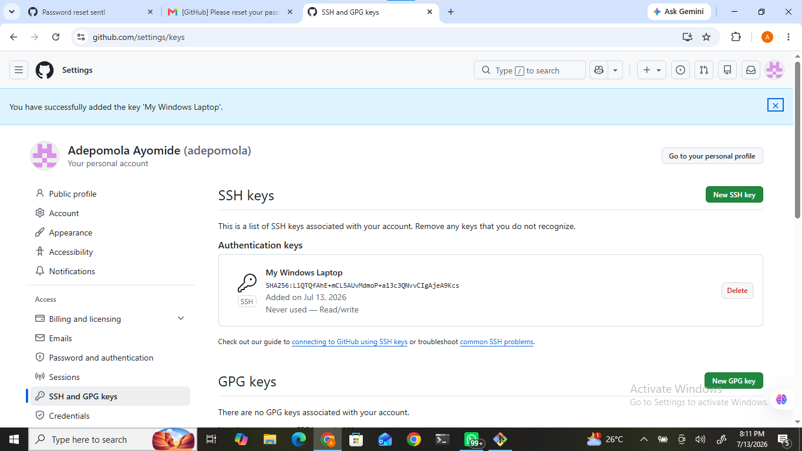
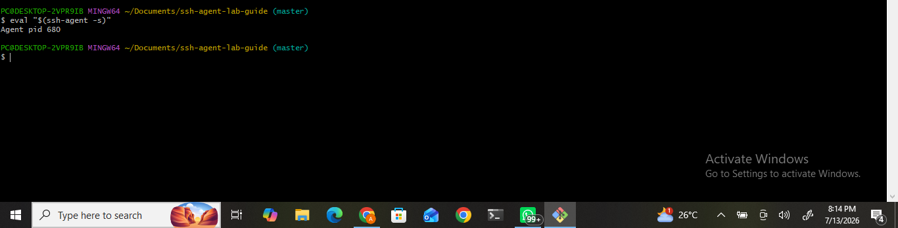
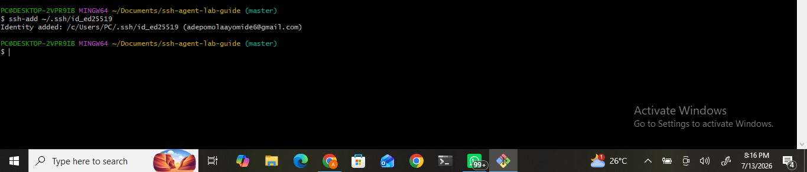
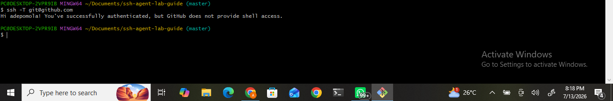

# SSH Agent Lab Guide

## Project Overview

This project demonstrates how to generate and manage SSH keys using the SSH Agent. SSH (Secure Shell) is a secure network protocol used to authenticate users and establish encrypted connections between systems. By configuring SSH authentication with GitHub, developers can securely interact with remote repositories without repeatedly entering their usernames and passwords.

This lab covers the complete process of checking for an existing SSH key, adding the public key to GitHub, starting the SSH Agent, loading the SSH key into the agent, and verifying a successful SSH connection.

---

## Project Objectives

The objectives of this project are to:

- Understand the purpose of SSH authentication.
- Learn how to generate an SSH key pair.
- Identify existing SSH keys on a local machine.
- Copy and register a public SSH key on GitHub.
- Start and manage the SSH Agent.
- Add an SSH private key to the SSH Agent.
- Verify successful authentication with GitHub using SSH.
- Improve security by replacing password-based authentication with SSH key authentication.

---

## Prerequisites

Before beginning this project, ensure the following requirements are met:

- Windows computer
- Git for Windows (Git Bash)
- GitHub account
- Internet connection
- Basic knowledge of Git and GitHub

---

# Project Implementation

## Step 1: Create the Project Directory

A project directory was created and initialized as a Git repository.

### Commands

```bash
mkdir ssh-agent-lab-guide
cd ssh-agent-lab-guide
git init
```


### Expected Output

```
Initialized empty Git repository...
```


### Screenshot


---

## Step 2: Check for Existing SSH Keys

Before generating a new SSH key, the existing SSH directory was checked.

### Command

```bash
ls ~/.ssh
```


### Expected Output

```
id_ed25519
id_ed25519.pub
```


This confirms that an SSH key pair already exists.

### Screenshot


---

## Step 3: Verify SSH Key Files

The contents of the SSH directory were listed to verify the available SSH keys.

### Command

```bash
ls -l ~/.ssh
```

### Expected Output

The output displays the SSH private key, public key, and other SSH configuration files.

### Screenshot



---

## Step 4: Display the Public SSH Key

The public key was displayed so it could be copied to GitHub.

### Command

```bash
cat ~/.ssh/id_ed25519.pub
```


### Expected Output

```
ssh-ed25519 AAAAC3...
```


The entire output was copied.

### Screenshot



---

## Step 5: Add the Public Key to GitHub

The copied public key was added to GitHub.

### Procedure

- Log in to GitHub.
- Open *Settings*.
- Navigate to *SSH and GPG Keys*.
- Click *New SSH Key*.
- Enter a descriptive title.
- Paste the copied public key.
- Click *Add SSH Key*.

### Screenshots




---

## Step 6: Start the SSH Agent

The SSH Agent was started.

### Command

```bash
eval "$(ssh-agent -s)"
```


### Expected Output

```

Agent pid xxxx
```

### Screenshot



---

## Step 7: Add the SSH Key to the SSH Agent

The SSH private key was loaded into the SSH Agent.

### Command

```bash
ssh-add ~/.ssh/id_ed25519
```


### Expected Output

```
Identity added...
```


### Screenshot



---

## Step 8: Test the SSH Connection

The SSH connection to GitHub was tested.

### Command

```bash
ssh -T git@github.com
```


### Expected Output

```
Hi username! You've successfully authenticated, but GitHub does not provide shell access.
```


This confirms that SSH authentication is correctly configured.

### Screenshot



---

# Project Directory Structure

```
ssh-agent-lab-guide/
│
├── screenshots/
│   ├── 01-git-init.png
│   ├── 02-check-existing-ssh-key.png
│   ├── 03-ssh-key-files.png
│   ├── 04-public-ssh-key.png
│   ├── 05-add-ssh-key-page.png
│   ├── 06-ssh-key-added.png
│   ├── 07-start-ssh-agent.png
│   ├── 08-add-key-to-agent.png
│   └── 09-test-github-ssh.png
│
└── README.md
```


---

# Commands Summary

| Command | Description |
|----------|-------------|
| `git init` | Initializes a Git repository |
| `ls ~/.ssh` | Lists available SSH keys |
| `ls -l ~/.ssh` | Displays detailed SSH key information |
| `cat ~/.ssh/id_ed25519.pub` | Displays the public SSH key |
| `eval "$(ssh-agent -s)"` | Starts the SSH Agent |
| `ssh-add ~/.ssh/id_ed25519` | Adds the private key to the SSH Agent |
| `ssh -T git@github.com` | Tests the SSH connection with GitHub |

---

# Key Concepts Learned

Throughout this project, the following concepts were learned:

- SSH authentication
- Public and private key pairs
- Secure authentication using SSH
- SSH Agent management
- GitHub SSH configuration
- Passwordless authentication
- Secure access to remote repositories

---

# Challenges Encountered

Some common challenges during this project included:

- Identifying whether an SSH key already existed.
- Locating GitHub's SSH and GPG Keys settings.
- Copying the correct public SSH key.
- Understanding the difference between public and private SSH keys.

These challenges were resolved by verifying the SSH directory, using the public key file (id_ed25519.pub), and successfully configuring GitHub authentication.

---

# Learning Outcomes

At the end of this project, I was able to:

- Understand SSH authentication.
- Configure GitHub for SSH access.
- Manage SSH keys securely.
- Start and use the SSH Agent.
- Authenticate with GitHub using SSH.
- Improve the security of Git operations.

---

# Conclusion

This project successfully demonstrated the process of configuring SSH authentication with GitHub using the SSH Agent. By adding an SSH key to GitHub and loading it into the SSH Agent, secure communication between the local machine and GitHub was established. This configuration eliminates the need to repeatedly enter passwords while enhancing the security and efficiency of Git operations.

---

# References

- [Git Documentation](https://git-scm.com/docs)
- [GitHub SSH Documentation](https://docs.github.com/en/authentication/connecting-to-github-with-ssh)
- [OpenSSH Documentation](https://www.openssh.com/manual.html)

---

*Author*

*Adepomola Ayomide*

DevOps Engineering Student

SSH Agent Lab Guide